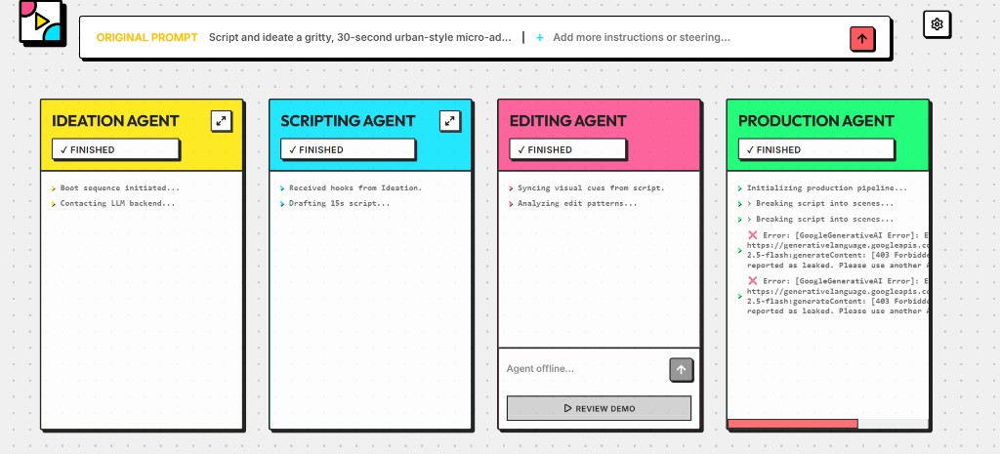

# 🎬 THE BRAND FACTORY

### *Autonomous AI Video Production Pipeline*


**The Brand Factory** is a high-performance, multi-agent AI pipeline designed to transform simple text prompts into production-ready social media advertisements in seconds. Built with a **Neobrutalist** aesthetic, it combines cutting-edge LLM orchestration with a powerful cloud-based rendering engine.

---

## 🚀 Key Features

### 🤖 Multi-Agent Orchestration
Our proprietary pipeline uses a team of specialized AI agents working in parallel:
- **Ideation Agent**: Brainstorms high-impact concepts and hooks.
- **Scripting Agent**: Drafts tight, 15-second high-conversion scripts.
- **Editing Agent**: Handles visual cues, transitions, and style constraints.
- **Production Agent**: Orchestrates the final video rendering and asset assembly.



### 🎨 Pro AI Video Editor
Review and refine your generated ads with our integrated AI Editor.
- **Auto-Generated Timelines**: AI pre-segments your video for easy adjustments.
- **Real-Time Previews**: See changes instantly before pushing to production.
- **Retro-TV Framing**: Optional aesthetic filters for that signature Brand Factory look.

### 📈 Social Media Ready
One-click "Push to Production" exports your videos optimized for TikTok, Instagram Reels, and YouTube Shorts.

---

## 🛠️ Tech Stack

- **Frontend**: React 19, TypeScript, Vite, Lucide Icons
- **Styling**: Vanilla CSS (Custom Neobrutalist Design System)
- **Backend**: Node.js, Express, Gemini AI (Google Generative AI)
- **Video Logic**: Custom scene-based rendering pipeline

---

## 🚦 Getting Started

### 1. Prerequisites
- Node.js (v18+)
- Gemini API Key

### 2. Installation
```bash
# Clone the repository
git clone https://github.com/GauravS11112003/TheBrandFactory.git

# Install frontend dependencies
npm install

# Install server dependencies
cd server
npm install
```

### 3. Environment Setup
Create a `.env` file in the root and the `server` directory:
```env
# Root /.env
VITE_API_URL=http://localhost:3000

# Server /server/.env
GEMINI_API_KEY=your_api_key_here
PORT=3000
```

### 4. Running the App
```bash
# Start the backend (from the server folder)
npm run dev

# Start the frontend (from the root folder)
npm run dev
```

---

## 🛡️ License
Distributed under the ISC License. See `LICENSE` for more information.

---
Built with ❤️ by **The Ad Factory Team**
